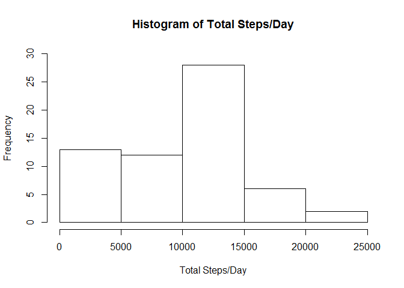
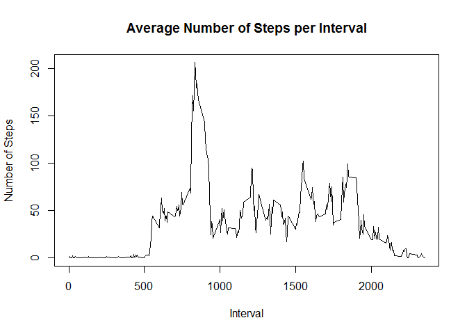
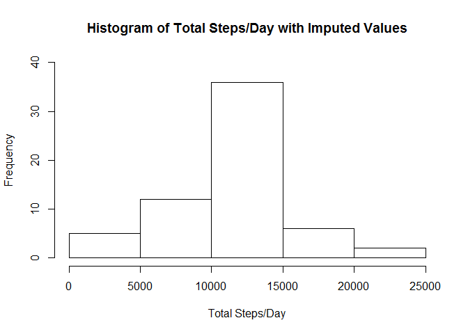
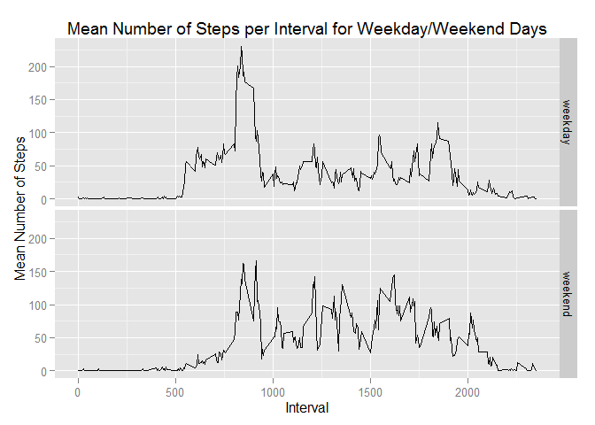

# Reproducible Research: Peer Assessment 1


## A. Loading and preprocessing the data
* Unzip the file to get the uncompressed activity.csv file.
* Then load this .csv file.


```r
unzip("activity.zip")
data<-read.csv("activity.csv")
```

## B. What is mean total number of steps taken per day?
* Group the steps by date, calculate the total number of steps per day, plot a histogram of the total number
of steps/day, and report mean and median number of steps per day.


```r
library(dplyr)
grouped <- group_by(data, date)
totalPerDay<-summarize(grouped, total=sum(steps, na.rm=TRUE))
hist(totalPerDay$total, main="Histogram of Total Steps/Day", xlab="Total Steps/Day", ylim=c(0,30))
```

 
  
The mean and median steps per day can be calculated from the total number of steps per day.

```r
meanPerDay<-mean(totalPerDay$total, na.rm=TRUE)
medianPerDay<-median(totalPerDay$total, na.rm=TRUE)
```
If missing values are ignored, the mean steps per day, meanPerDay, is 9354 and the median number of steps per day, medianPerDay, is 10395.

## C. What is the average daily activity pattern?
* Make a time series plot of 5-minute interval versus the mean number of steps taken, averaged across all days.
* Identify and report the interval that contains the maximum number of steps, across all days.

Calculate a dataframe containing the average number of steps for each interval across all days in the dataset, meanSteps. Use this to generate a time series plot demonstrating the average daily activity pattern.

```r
meanSteps<-summarize(group_by(data, interval), meanSteps=mean(steps, na.rm=TRUE))
plot(meanSteps$interval, meanSteps$meanSteps, type="l", xlab="Interval", ylab="Number of Steps", main="Average Number of Steps per Interval")
```

 

The interval containing the maximum average number of steps can be identified from the dataframe meanSteps.

```r
maxMeanSteps<-max(meanSteps$meanSteps)
maxInterval<-meanSteps[which(meanSteps$meanSteps == maxMeanSteps), c("interval")]
```
The maximum average number of steps, maxMeanSteps, is 206.1698113 and is located in interval 835, maxInterval. 

## D. Imputing missing values
* Calculate and report the total number of missing values in the dataset (i.e. the total number of rows with NAs)
* Devise a strategy for filling in all of the missing values in the dataset. 
* Create a new dataset that is equal to the original dataset but with the missing data filled in.
* Make a histogram of the total number of steps taken each day and Calculate and report the mean and median total number of steps taken per day. 

The number of missing step values in the dataset can be calculated by counting the number of NA values. 

```r
missingNo<-sum(is.na(data$steps))
```
  
The number of missing values, missingNo, is 2304.
  
A new dataset, newdata, will be created where missing values will be replaced by the mean number of steps per day for that interval across all days as calculated in Section C above and stored in the dataframe meanSteps.

```r
newdata<-data
for(i in 1:length(newdata$steps)){
  if(is.na(newdata[i,c("steps")])){
    newdata[i,c("steps")]<-meanSteps[which(meanSteps$interval == newdata[i,c("interval")]), c("meanSteps")]
  }
}
```

Create a new histogram of the total number of steps taken each day using the dataset with imputed values and report the mean and median total number of steps.

```r
library(dplyr)
groupedImp <- group_by(newdata, date)
totalPerDayImputed<-summarize(groupedImp, total=sum(steps, na.rm=TRUE))
hist(totalPerDayImputed$total, main="Histogram of Total Steps/Day with Imputed Values", xlab="Total Steps/Day", ylim=c(0,40))
```

 

Same as before, the mean and median steps per day can be calculated from the total number of steps per day.

```r
meanPerDayImp<-mean(totalPerDayImputed$total, na.rm=TRUE)
medianPerDayImp<-median(totalPerDayImputed$total, na.rm=TRUE)
```
Once we inpute the missing values, the mean number of steps per day, meanPerDayImp, is 10766 and the median number of steps per day, medianPerDayImp, is 10766.

## E. Are there differences in activity patterns between weekdays and weekends?
* Create a new factor variable in the dataset with two levels – “weekday” and “weekend".
* Make a panel plot containing a time series plot of 5-minute interval versus the mean number of steps taken, averaged across all weekday days or weekend days.

Create new factor in dataset indicating whether a day is a weekday or weekend.

```r
newdata$dayType=weekdays(as.Date(newdata$date, format="%Y-%m-%d"),abbreviate=TRUE)=="Sat"|weekdays(as.Date(newdata$date, format="%Y-%m-%d"),abbreviate=TRUE)=="Sun"
newdata[which(newdata$dayType == TRUE), c("dayType")]<-c("weekend")
newdata[which(newdata$dayType == FALSE), c("dayType")]<-c("weekday")
newdata$dayType<-factor(newdata$dayType)
```

Create a panel plot examining activity levels(steps) for each interval for weekday days and weekend days

```r
library(ggplot2)
groupedIntImp<-group_by(newdata, interval, dayType)
meanStepsImp<-summarize(groupedIntImp, meanSteps=mean(steps, na.rm=TRUE))

p <- ggplot(meanStepsImp, aes(interval, meanSteps)) + geom_line()
p+facet_grid(dayType~.)+labs(title="Mean Number of Steps per Interval for Weekday/Weekend Days", x="Interval", y="Mean Number of Steps")
```

 
  
The above figure demonstrates that there are differences in activity patterns between weekday and weekend days. For example, the sharp increase in activity in weekday mornings near interval 500 is much less pronounced on the weekend days.


